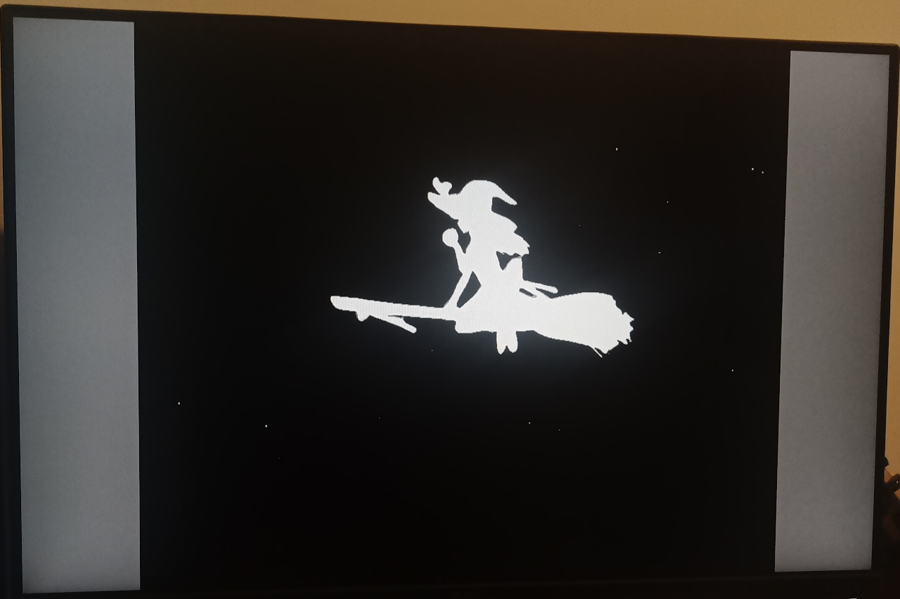
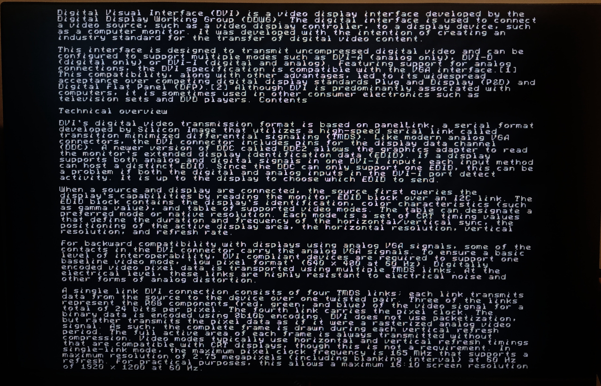

Building
--------

You need to have the Pico SDK installed, as well as a recent CMake and arm-none-eabi-gcc.


```bash
mkdir build
cd build
PICO_SDK_PATH=path/to/sdk cmake -DPICO_COPY_TO_RAM=1 ..
make -j$(nproc)
```

This will build all the example apps. You can then do e.g.

```bash
cp apps/sprite_bounce/sprite_bounce.uf2 /media/${USER}/RPI-RP2/
```

To flash a DVI board plugged into your system.

Example Apps
------------

### Bad Apple



Plays the Touhou music video at 720p 30FPS (no sound). Because the video is largely black and white silhouettes, it's highly compressible, and there is a shortcut for encoding full-res TMDS scanlines with a 2-colour palette ([check the source](apps/bad_apple/rle_decompress.S)). Currently around 1 minute of video fits in 16 MiB of flash, with per-scanline RLE compression. Eventually I'd like to fit the whole video.

### Terminal



Display text with an 8x8px black and white font, displayed at full resolution (so 80x60 characters at 640x480p 60 Hz, or 160x90 characters at 720p30). This works by storing the font as a set of canned 8-symbol pre-balanced TMDS sequences, so the scanline rendering takes only around 30% of one core. This is a fairly practical way to add a DVI terminal/console to an existing project.

One drawback of this technique is the memory footprint of the pre-balanced font: 256 bytes per 8x8 pixel character, so around 24 kB for all printable ASCII characters. There is an alternative technique for encoding directly from a 1bpp image, so the memory footprint can be reduced, at the cost of more CPU cycles spent on TMDS encode.

### Vista


Full-resolution VGA RGB565 image viewer. As each raw image is over 600 kB, only a small slice of the image can reside in memory at once, so images are streamed continuously from flash at 40 MB/s. The TMDS encode uses around 95% of both cores, which is why we need a raw image format. The remaining 5% of core 1 handles the horizontal DMA interrupts to keep the DVI signalling going, and core 0 handles the streaming of the image from flash. This is not very practical, but it was a fun project.

If you define the symbol `TMDS_FULLRES_NO_DC_BALANCE` then you can remove the DC balance feedback from the TMDS encode, which *may* give you enough time to do something more interesting with full-resolution RGB graphics, provided your DVI signals are DC-coupled, and your TV is feeling lenient. This is absolutely forbidden by the standard, but don't worry, I won't tell anyone if you do this.

### Hello DVI

Minimal DVI example. Displays a scrolling QVGA RGB565 test card with a 640x480p 60Hz DVI mode.

### Mandelbrot

Render a Mandelbrot set to a QVGA RGB565 framebuffer.

### Sprite Bounce

A bunch of images bouncing around on the screen, using my sprite library written for ARMv6M. This uses pixel-doubled RGB graphics, with DVI modes ranging from 640x480p 60Hz to 1280x720p 30Hz. Core 0 renders the graphics, one scanline at a time, and passes scanlines to core 1 for encoding and shipping out to the display.

